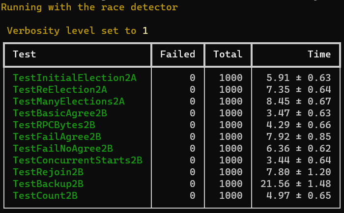
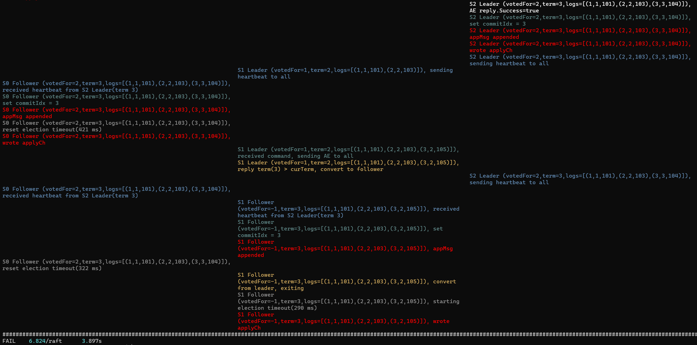

# MIT-6.824

连接：[mit-6.824](https://pdos.csail.mit.edu/6.824/schedule.html)

这是一个刚启动 & 进行中的项目，目前完成了：MapReduce，Raft（leader election, log） 

Most comments in the code are in Chinese. If you need an English translation, please let me know.

Copying my code is not recommended.

## Lab 1: MapReduce

**测试结果**：

```text
*** Starting wc test.
--- wc test: PASS
*** Starting indexer test.
--- indexer test: PASS
*** Starting map parallelism test.
--- map parallelism test: PASS
*** Starting reduce parallelism test.
--- reduce parallelism test: PASS
*** Starting job count test.
--- job count test: PASS
*** Starting early exit test.
--- early exit test: PASS
*** Starting crash test.
--- crash test: PASS
*** PASSED ALL TESTS
```

**思路：**

coordinator 是一个 server，worker 向他请求任务，worker 并不知道自己会被分配什么任务，coordinator 执行会维护所有任务的状态，起初他分配 map 任务，所有 map 任务完成后，开始分配 reduce 任务，直至所有任务完成。

对于同一个 woker 会收到两个一样的任务（当然他们派发的时间不同）、worker 收到老旧的曾滞留在网络中任务的问题：

- 分配任务时会告知这是发送给此 worker 的第几个任务，即：`WorkerApplyTaskSeq`
- 所以只有最新的任务会被执行，其余都会被丢弃

对于 coordinator 会收到同一个任务的多个执行结果的问题，

- 告知 coordinator 这是这个任务的第几次分配，即：`TaskAllocSeq`
- 所以只有最新的任务的回复会被接受，其余都会被丢弃

如果 coordinator 发出去的任务超时了（没有在10秒内收到结果），那么这个任务会被重放，参见`taskWaiter(...)`；如果这个任务没有超时，那么他不会再回到任务队列，且会被标记为已完成。在实际的代码中，任务只是标识每个任务的唯一ID，或者说在我的实现中，任务不会动态变化（当然这也是这个实验的本意）。

coordinator 端会维护一个任务队列（线程安全的），可以理解为往队列里放任务和拿任务都是原子的。

只要 coordinator 收到的回复是最新的，那么一定会有个 taskWaiter 在等待（还未超时）。因为如果 taskWaiter 已超时退出，那么这个任务一定已被重放并且它的 `TaskAllocSeq` 一定已被递增，这时即使旧的任务的回复到达，也会因为 `TaskAllocSeq` 检查不通过而被丢弃，不会因为 taskWaiter 退出而被阻塞。

一个例子：

- 0s，A 拿到任务 map-1(0)，任务被标记为`IN_PROGRESS`，启动`taskWaiter`
- 10s，A 超时未完成，导致任务被标记为`IDEL`，并被重放，`taskWaiter`退出
- 10.1s，B 拿到任务 map-1(1)，任务被标记为`IN_PROGRESS`，启动`taskWaiter`
- 11s，
  - 假如 A 先返回，在调用`NotifyTaskComplete`时，会因为`args.TaskAllocSeq == latestSeq`无法通过而被丢弃，`taskWaiter`仍在等待
  - 假如 B 先返回，唤醒  task 对应的 `taskWaiter`，
    - 标记任务为`COMPLETE` ，`taskWaiter`退出

## Lab 2: Raft

### Part 2A: leader election

**结果：**

```shell
$ time go test -run 2A
Test (2A): initial election ...
  ... Passed --   3.0  3   58   14992    0
Test (2A): election after network failure ...
  ... Passed --   4.4  3  123   23290    0
Test (2A): multiple elections ...
  ... Passed --   5.8  7  636  117958    0
PASS
ok      6.824/raft      13.268s

real    0m13.418s
user    0m0.400s
sys     0m0.137s
```

用 dstest 进行多轮测试，通过一万次测试：


**辅助工具：**

我使用了 [deadlock](https://pkg.go.dev/github.com/sasha-s/go-deadlock#section-readme) 包，它帮助我解决了很多代码逻辑错误，此外 `-race` 选项也是有很大作用的。

课程提供了 `dstest` 和 `dslogs` 工具，他们也非常有用，见 [Debugging by Pretty Printing (josejg.com)](https://blog.josejg.com/debugging-pretty/)。

**整体思路（§5.2）：**

- 起初所有节点以 follower 身份启动
- 某个节点的 election timeout 超时之后，它成为 candidate：
  - 增加其当前任期
  - 为自己投票
  - 向其他服务器并行发出 RequestVote RPC 
-  candidate 一直处于这种状态，直到发生以下三种情况之一 
  - 它赢得了选举（少数服从多数的原则保证了最多只有一名 candidate 能够在**某一任期**内赢得选举），成为 leader
    - 然后，它向所有其他服务器发送心跳信息，以建立其权威并防止新的选举  
  - 其他服务器确立了自己的领导地位（在等待投票时， candidate 可能会收到来自另一台声称是 leader 的服务器的 AppendEntries RPC ）
    - 如果这个 leader 的任期至少与 candidate 的当前任期一样大，则 candidate 承认 leader 是合法的并返回到追随者状态
    - 否则拒绝 RPC 并继续处于候选者状态  
  - 一段时间内没有赢家，即没有候选者获得多数票（原因多种多样：被网络阻塞的 RequestVote、选票被平分等）
    - 候选者都会超时并通过增加其任期并启动另一轮 RequestVote RPC 来开始新的选举。  

**注意：**

要时刻注意这一点：If RPC request or response contains term T > currentTerm: set currentTerm = T, convert to follower (§5.1)

- 所以任何时候，一个节点收到 RPC 请求或响应，只要 term T > currentTerm，那么这个节点就会转换成 follower
  - candidate 可能在 call RequestVote RPC 过程中，因为收到来自新 leader 的 AppendEntries 而转变成 follower。这个 leader 可能是同任期选举出的，见 §5.2：“If the leader’s term (included in its RPC) is at least as large as the candidate’s current term, then the candidate recognizes the leader as legitimate and returns to follower state.  “
  - leader 也可能因为上述判断而突然转换成 follower。
- 与之相对的，“If a server receives a request with a stale term number, it rejects the request.  ”

因此 candidate 选举成功或者选举失败时，需要对一些东西进行处理，比如定时器、还在进行中的 call  RequestVote 等；类似的，节点是 leader 时，也要注意这个问题。

注意 Hints 中提及：“当 tester 永久关闭一个实例时，它会调用你的 Raft 的 `rf.Kill()`。 您可以使用 `rf.killed()` 检查是否调用了 `Kill()`。您可能希望在**所有循环**中执行此操作，以避免已死亡的 Raft 实例打印出令人困惑的消息。”

也许检查 Go程 的泄露是有必要的，可以在`test_test.go`中添加以下代码测试 Go程 泄露：

```go
func TestMain(m *testing.M) {
	goleak.VerifyTestMain(m)
}
```

然而测试代码本身就有一些泄露，但我不打算更改测试代码。

### Part 2B: log 

**结果：**

```shell
$ time go test -run 2B
Test (2B): basic agreement ...
  ... Passed --   0.6  3   16    4142    3
Test (2B): RPC byte count ...
  ... Passed --   1.5  3   48  113114   11
Test (2B): agreement after follower reconnects ...
  ... Passed --   5.5  3  135   33608    8
Test (2B): no agreement if too many followers disconnect ...
  ... Passed --   3.4  5  214   43276    3
Test (2B): concurrent Start()s ...
  ... Passed --   0.5  3   20    5615    6
Test (2B): rejoin of partitioned leader ...
  ... Passed --   5.8  3  185   43674    4
Test (2B): leader backs up quickly over incorrect follower logs ...
  ... Passed --  14.6  5 2963 2344810  102
Test (2B): RPC counts aren't too high ...
  ... Passed --   2.0  3   60   17354   12
PASS
ok      6.824/raft      33.977s

real    0m34.159s
user    0m1.139s
sys     0m0.607s
```

用 dstest 进行多轮测试，通过一千次测试（由于一万次过于耗时，这里先进行一千次……）：



**注意点：**

- 对于所有服务器：“If commitIndex > lastApplied: increment lastApplied, apply log[lastApplied] to state machine (§5.3)”，也就是说 commitIndex 更新时应做这个检查
  - leader 会 主动更新 commitIndex：“If there exists an N such that N > commitIndex, a majority of matchIndex[i] ≥ N, and log[N].term == currentTerm: set commitIndex = N (§5.3, §5.4)”
  - follower 在收到 AppendEntries RPC 的时候更新 commitIndex：“5. If leaderCommit > commitIndex, set commitIndex = min(leaderCommit, index of last new entry)”
- 必须实现选举限制：“RequestVote RPC实现了这一限制：RPC包括关于候选人日志的信息，如果投票人自己的日志比候选人的日志更新时，则拒绝投票。”

- `nextIndex[i]`的更新逻辑应为：`rf.nextIndex[target] = wrReply.args.PrevLogIndex + len(wrReply.args.Entries) + 1`，而不是用`len(wrReply.args.Entries)`直接递增。因为先后两次收到 `Entries=(1,1)` 、 `Entries=(1,1),(2,1)` 的 AE RPC 和一次性收到  `Entries=(1,1),(2,1)` ，`nextIndex[i]`的值应该是相同的

**其他：**

我在 debug TestRejoin2B 的过程中遇到的问题（下图是一个错误）：



图中 S1 是一个离开集群一段时间的旧 leader，现在真正的 leader 是 S2，它的任期是 3，commitIndex 为 3，S2 的 log 为：

```text
index: 1   2   3
       -----------
term:  1   2   3
cmd:   101 103 104
```

S1 的 commitIndex 为 2，S1 的 log 为：

```text
index: 1   2   3
       -----------
term:  1   2   2
cmd:   101 103 105
```

那么这个判断：If leaderCommit > commitIndex, set commitIndex = min(leaderCommit, index of last new entry)，显然是不能被执行的，所以这里把 AE 作为心跳时的 prevLogIndex 置为 leader 最新的 log，即 `prevLogIndex := len(rf.log) - 1` ，即 3，那么这个 AE 就会被回复失败而不会走到这一步。

另一个值得注意的问题是，follower 可能收到历史的 AE，例如，某个 follower 的 log 现在为：

```text
index: 1   2   3
       -----------
term:  1   1   1
```

且都已提交，此后他收到一个历史 AE，Entries 可能是后面两个 log 条目，那么这个 follower 必须不把任何条目删除。我的实现如下：

```go
i := 0
j := args.PrevLogIndex + 1
for i < len(args.Entries) && j < len(rf.log) {
    if rf.log[j].Term != args.Entries[i].Term {
        rf.log = rf.log[0:j]
        break
    }
    i++
    j++
}

if i < len(args.Entries) {
    st := len(rf.log)
    rf.log = append(rf.log, args.Entries[i:]...)
}
```

